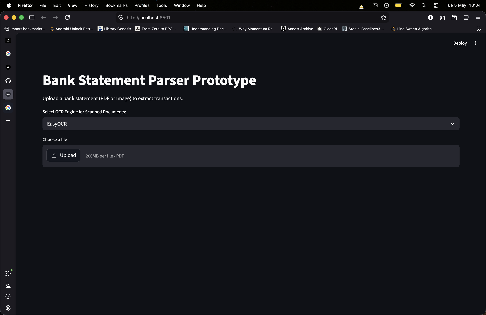
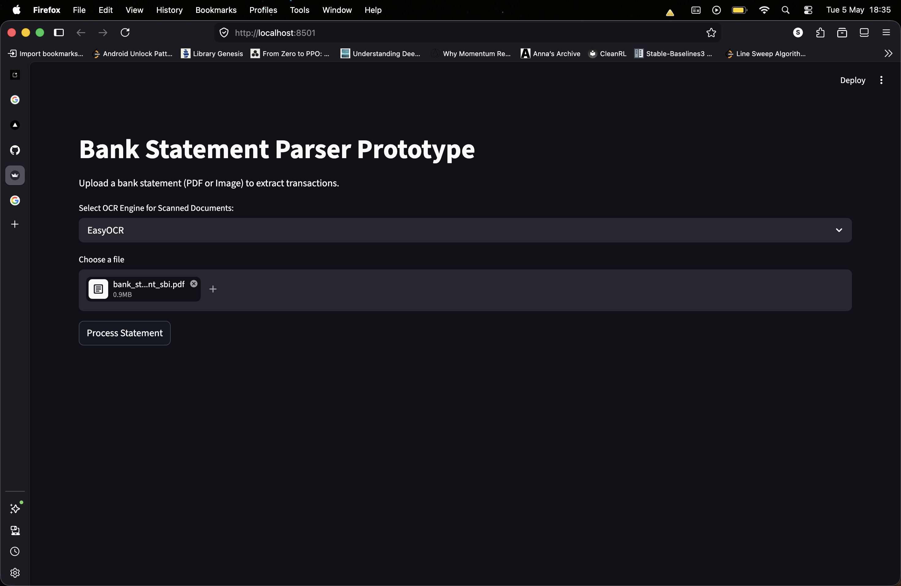
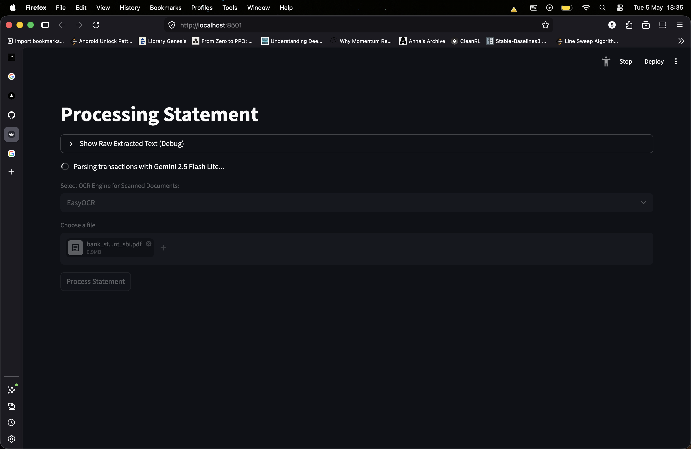
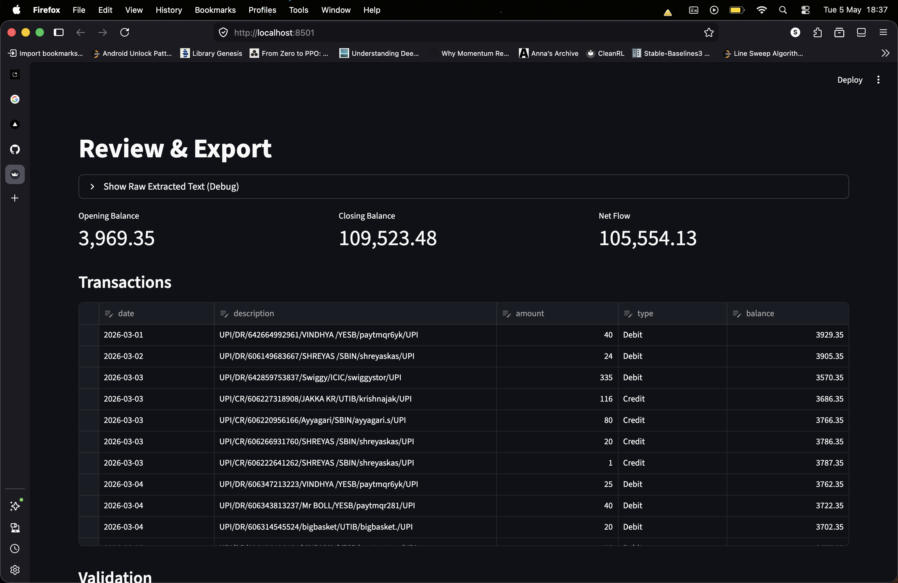
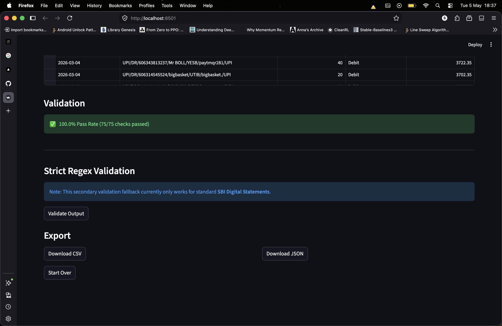
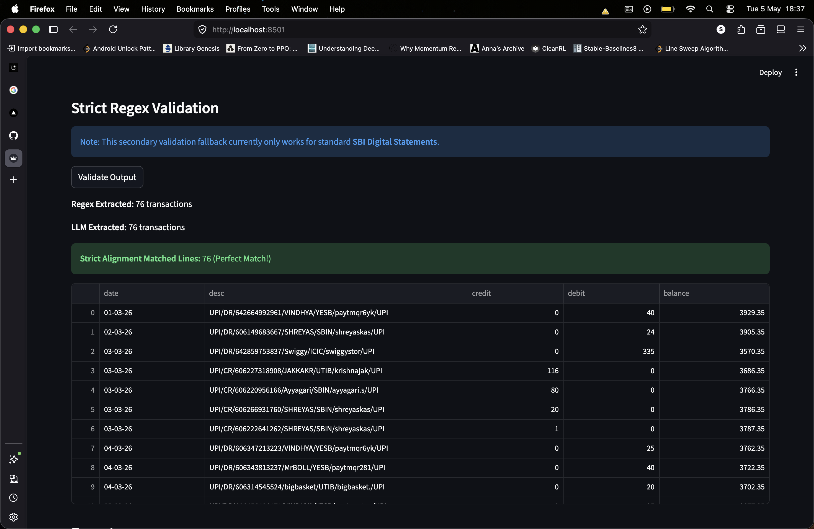

# Bank Statement Processing Suite

This repository contains a full end-to-end suite for generating synthetic bank statements, applying realistic document degradation, and extracting structured transactional data using LLMs and OCR technologies.

## Contents

This project is divided into two main sub-components:

### 1. [Bank Statement Generator](./bank_statement_generator/)
A highly configurable pipeline to synthesize realistic bank statements for testing OCR and extraction logic.
- **Realistic Data Synthesis**: Generates logical transaction patterns based on user personas (Salaried, Freelance, High Spend, Low Spend).
- **Document Degradation Pipeline (`noise_fx.py`)**: Simulates real-world physical scans with image processing to create realistic looking scanned bank statements:
    - **Physical Noise**: Gaussian blur, grain, and salt-and-pepper speckle.
    - **Geometric Distortions**: Random skewing and rotation to mimic misaligned scans.
    - **Visual Artifacts**: Transparent watermarks ("CONFIDENTIAL") and digital "PROCESSED" stamps.
    - **Compression Artifacts**: Configurable JPEG quality and variable DPI (150-300) for authentic "scanned" aesthetics.
- **Hybrid Output**: Generates both clean vector PDFs and heavily degraded "scanned" PDF-of-images.

### 2. [Bank Statement Parser](./bank_statement_parser/)
An intelligent extraction prototype designed to handle both digital-native and low-quality scanned documents.
- **Multi-Engine OCR Strategy**:
    - **Direct Extraction**: Uses `pypdf` for fast, 100% accurate extraction from digital vector PDFs.
    - **OCR Fallback**: Automatically rasterizes and processes scanned documents using **EasyOCR** or **Tesseract**.
- **LLM-Powered Extraction**: Leverages **Gemini 2.0/2.5 Flash** models to parse messy OCR text into structured JSON/CSV.
- **Self-Correction & Retry Logic**: Implements a 3-stage retry mechanism that feeds validation errors back to the LLM for refined parsing.
- **Dual-Layer Validation Pipeline**:
    - **Arithmetic Verification**: Programmatically checks that `Opening Balance +/- Transactions = Closing Balance` for every statement.
    - **Running Balance Check**: Validates the mathematical consistency of every single row in the transaction table.
    - **Regex Fallback**: Includes a strict regex-based parser for SBI bank statements.
- **Automated Evaluation Framework (`evaluate.py`)**: A benchmarking script that scores the parser's performance against the Generator's ground-truth data, reporting accuracy across four dimensions: Date, Amount, Type, and Balance.
- **Interactive UI**: A full-featured **Streamlit** dashboard for manual document testing, live result editing, and exporting to CSV/JSON.

## Preview

### Generating Synthetic Data
Navigate to the generator folder and run the CLI to create some test statements:
```bash
cd bank_statement_generator
python generator.py --count 5 --all-presets
```

### Evaluating the Parser
Test the parser's robustness against the noisy generated data:
```bash
cd ../bank_statement_parser
conda run -n smai python evaluate.py
```

### Running the Interactive UI
Launch the Streamlit app to manually upload and test bank statements:
```bash
cd bank_statement_parser
streamlit run app.py
```

## Dependencies

Ensure you have installed the required dependencies for both components. For the parser, you will need the dependencies which can be installed as follows:
- `pip install -r bank_statement_parser/requirements.txt`
- Tesseract OCR system binary (e.g., `brew install tesseract` on macOS)
- A valid Google Gemini API Key configured in your environment (`GEMINI_API_KEY`).

## Results:
The pipeline is evaluated on 2 different data generation presets:
1. **Clean**: No noise added, digital pdfs.
2. **Light Noise**: Light noise added to the statements which are saved in a format similar to scanned pdfs(pdf of images).

For each preset, the reported metrics are per-field accuracy in the table

### For clean:
| Field | Accuracy |
| ----- | -------- |
| Date  | 100.0%   |
| Amount| 100.0%   |
|Type |   100.0%|
|Balance | 100.0%|

### For light noise:
| Field | Accuracy |
| ----- | -------- |
|Date | 100.0% |
|Amount | 97.4% |
|Type |    96.1%|
|Balance | 100.0% |

### For heavy noise:
| Field | Accuracy |
| ----- | -------- |
| Date |    90.8%|
|Amount |  33.6% |
|Type |    85.7%|
|Balance | 42.0%|

Note that the evaluation metrics show disproportionately poor performance for heavy noise because a single row in the table was missed and all entries below it were moved up.

## Screenshots

### Starting page:
Note that two options are available for OCR(EasyOCR and Tesseract) Tesseract gives marginally worse results than the reported results which are for EasyOCR.


### After pdf upload:


### Processing Loading screen:


### CSV generated and rendered on Streamlit:


### Arithmetic validation and download buttons:
Ground truth labels are not easy to obtain, this is where the data generator comes in handy. The generator is able to provide perfect ground truth labels for evaluation. Also the arithmetic validation is used to check the integrity of the extracted data mathematically for any labelled or unlabelled data.


### Regex validation for SBI accounts:
I personally have an SBI account so using bank statements from SBI I made a regex parser which can be used as ground truth for validation. The LLM based extraction is still required for a general case.


## AI Usage:
Data generation code and streamlit scaffolding were generated by Claude. `evaluate.py` was generated by Antigravity.

GitHub: https://github.com/s0han24/bank-statement-parser.git
